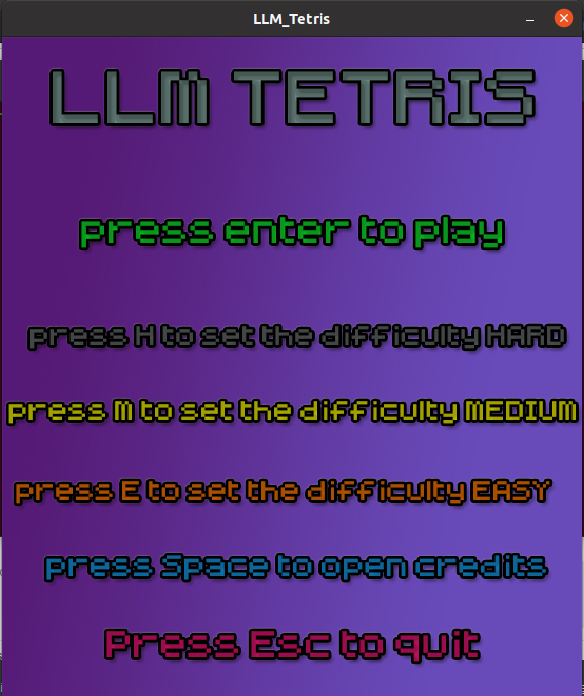

# TETRIS LLM
Jogo Tetris criado em C para o Projeto final de Introdução à programação do curso de Ciencia da Computação - UFG.
Criado pelos alunos:
* Luan César Dutra Carvalho
* Lucas Braga Santos
* Marcelo Alves P. Sobrinho

Sob orientação do Prof. Dr. Gustavo Laureano.

## Como usar:
Não foi testado no S.O Windows, apenas em sistemas baseados em Linux. Basta executar os seguintes procedimentos.
* Clone o repositório da maneira que preferir. Clicando no botão de clonar, ou executando o código.
``` 
git clone https://github.com/LuanCesarDC/Tetris_LLM
```
* Entre na pasta do repositório. Clique com o botão direito do mouse em qualquer lugar do fundo do gerenciador de arquivos, e depois clique em ```Abrir no Terminal```, ou ```Open in Terminal``` se estiver em ingles.

* Execute os seguintes códigos no terminal, na mesma ordem especificada.
```
cd TETRIS
```

* Execute esse passo se você não tiver o GCC, ou o Make instalado.
```
sudo apt-get install build-essential
```

* Execute esse passo se você não tiver as bibliotecas necessárias para compilar o programa.
```
sudo apt-get install libsdl2-2.0
sudo apt-get install libsdl2-dev
sudo apt-get install libsdl2-image-dev
sudo apt-get install libsdl2-ttf-dev
```
* Agora execute:
```
make
./main
```

## Sobre o jogo

O jogo é bastante intuitivo.
* ### &larr; e &rarr;  Movem a peça horizontalmente.
* ### ``"R"`` Roda a peça.
* ### ``Barra de Espaço`` Faz a peça descer mais rapidamente.

Há um menu inicial com as opções explicadas. Basta seguir as orientações.



 


